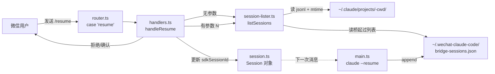

# WeChat Claude Code — `/resume` Command Specification

## Overview

Add a `/resume` slash command to the installed `wechat-claude-code` v1.0.0 (at `~/.claude/skills/wechat-claude-code/`). The command lets the user list the 10 most recent Claude Code sessions for the bridge's current working directory, see which sessions the bridge itself started vs. started from elsewhere, and resume any session by index or UUID.

The command is read-only when invoked without arguments and mutates the bridge session's `sdkSessionId` when invoked with an argument. Sessions that were modified in the last 5 minutes are flagged as **active** and require `--force` to resume — this prevents silently tearing the context of a Claude CLI window the user still has open.

## User-Facing Behavior

### `/resume` — list

Shows the 10 most recently modified `.jsonl` files under `~/.claude/projects/<encoded-cwd>/`:

```
📋 最近 10 条 session：

🟢 [1] 4分钟前  桥 [活跃] abc12345-...
    Q: 已经编译了吗

   [2] 22分钟前  CLI/其他 xyz98765-...
    Q: 帮我看一下 main.c

   [3] 1小时前  桥 fed54321-...
    Q: KConfig 怎么改

发送 /resume <编号> 接管；活跃 session 加 --force
```

- Sorted by file mtime, descending.
- Each row includes the full UUID (so users can `/resume <uuid>` directly).
- `Q:` shows the first user message of that session, truncated to 60 chars + `…`.
- `🟢` + `[活跃]` = mtime is within the last 5 minutes.
- `桥` = session was started by this bridge (recorded in `bridge-sessions.json`).
- `CLI/其他` = session started by Claude CLI, VSCode extension, or anywhere else.

### `/resume <N>` — resume by index

`N` is a 1-based index into the list returned by `/resume`. Updates `session.sdkSessionId` to that session's UUID. The next message the user sends will be sent to Claude with `--resume <uuid>`.

If the target is **active**, the command is rejected:

```
⚠️ session 活跃（4分钟前 写过），可能是 CLI 还开着。
强行接管加 --force：/resume 1 --force
```

### `/resume <N> --force` — force-resume an active session

Same as above but skips the active-session check. A `logger.warn` is emitted noting that the resume may tear an open CLI's context.

### `/resume <uuid>` — resume by raw UUID

Power-user form: directly pass a session UUID (the filename of the `.jsonl` minus the extension). Active-session check still applies unless `--force` is also given.

### `/help` — updated help text

Append one line to the existing help text:

```
/resume 列出最近 10 条 session，可接管
```

## Architecture



## Components

### New: `src/commands/session-lister.ts`

Pure module, no side effects on read paths. Exports:

```typescript
// Path encoding (verified against existing ~.claude/projects/-home-zizi-zesp32/)
export function encodeCwd(cwd: string): string;
export function getSessionDir(cwd: string): string;

// Returns sessions sorted by mtime desc, capped at limit
export interface SessionInfo {
  uuid: string;
  mtime: Date;
  firstUserPrompt: string;  // truncated to 60 chars + "…" if longer
  source: 'bridge' | 'unknown';  // 'unknown' = CLI/VSCode/elsewhere
  isActive: boolean;  // mtime within ACTIVE_THRESHOLD_MS
}
export async function listSessions(cwd: string, limit?: number): Promise<SessionInfo[]>;

// Bridge tracking — append after each successful query
export async function appendBridgeSessionId(uuid: string): Promise<void>;

// Display
export function formatSessionList(sessions: SessionInfo[]): string;
```

Constants:
- `ACTIVE_THRESHOLD_MS = 5 * 60 * 1000`
- `PROMPT_TRUNCATE_LEN = 60`

Implementation notes:
- Reads `bridge-sessions.json` once per `listSessions` call. With ≤10 sessions this is fine; no caching.
- Reads only the **first line** of each `.jsonl` for `firstUserPrompt`. Claude JSONL files start with a `user`-role event containing the first user prompt.
- Writes to `bridge-sessions.json` use a tmp file + rename for atomicity: `fs.writeFile(path + '.tmp', ...) ; fs.rename(tmp, path)`.
- All filesystem errors per file are swallowed (with logger.warn) — one bad jsonl must not abort the entire list.

### Modified: `src/commands/router.ts`

One-line addition inside the `switch`:

```typescript
case 'resume':
  return handleResume(ctx, args);
```

And add `handleResume` to the existing import from `./handlers.js`.

### Modified: `src/commands/handlers.ts`

Add `handleResume(ctx, args): Promise<CommandResult>` (async because it awaits `listSessions`).

Behavior:
- Empty args → call `listSessions(cwd, 10)`, return `formatSessionList` as `reply`.
- Parse args: split on whitespace, extract `--force` flag, remaining token is either a positive integer (index) or a UUID string.
- If integer: re-fetch `listSessions(cwd, 10)`, look up `sessions[N-1]`. If missing → reply "编号无效，请先 /resume 查看列表".
- If UUID form: re-fetch `listSessions(cwd, 100)`, find matching uuid. If missing → reply "未找到该 session".
- Active check: if `targetSession.isActive && !force` → reply with the warning shown above, return `handled: true`.
- Otherwise: call `ctx.updateSession({ sdkSessionId: uuid })`, log warn if force, return success reply.

Also update the `HELP_TEXT` constant to include the `/resume` line.

### Modified: `src/main.ts`

In the block where `session.sdkSessionId = result.sessionId` is assigned (around line 618), call `appendBridgeSessionId(result.sessionId)` immediately after, inside the same `try`/`catch`. Failures here must be caught and logged at warn level — they must NOT block the message reply that follows.

### New data file: `~/.wechat-claude-code/bridge-sessions.json`

```json
["uuid1", "uuid2", "..."]
```

- Plain JSON array of strings, one per line (pretty-printed for diff-ability).
- Append-only in practice (we never remove entries — file grows monotonically).
- A session UUID can appear at most once (checked before append).
- For a typical user this file stays under 10 KB.

## Data Flow

### Phase 1: List (`/resume` with no args)

1. Router matches `case 'resume'`, calls `handleResume(ctx, '')`.
2. `handleResume` calls `listSessions(cwd, 10)`.
3. `listSessions`:
   - `fs.readdir(getSessionDir(cwd))` → list of `.jsonl` files.
   - `fs.stat` each file → mtime.
   - For each file, `fs.readFile(path, 'utf-8')` + `split('\n', 1)[0]` + `JSON.parse` → extract `message.content[0].text`.
   - `fs.readFile(~/.wechat-claude-code/bridge-sessions.json)` → Set of bridge UUIDs.
   - Compute `source` (`bridge` if in set, else `unknown`).
   - Compute `isActive` (mtime within threshold).
   - Sort by mtime desc, slice to limit.
4. `handleResume` returns `{ reply: formatSessionList(sessions), handled: true }`.
5. Bridge sends reply to WeChat.

### Phase 2: Resume (`/resume 1`)

1. Router → `handleResume(ctx, '1')`.
2. Parse: `tokens = ['1']`, `force = false`, `target = '1'`.
3. `listSessions(cwd, 10)` → fetch list.
4. `sessions[0]` → uuid X.
5. Check `sessions[0].isActive`:
   - **Active + no force** → return warning reply, exit.
   - **Not active OR force** → `ctx.updateSession({ sdkSessionId: X })`.
6. Return success reply.
7. Next user message → main.ts builds `claude --resume X ...` → query runs → reply sent.

### Phase 3: Subsequent query append

1. `claudeQuery()` returns `{ sessionId: X, text, error? }`.
2. main.ts assigns `session.sdkSessionId = X`.
3. main.ts calls `await appendBridgeSessionId(X)`.
4. File write: `tmp = path + '.tmp'; writeFile(tmp, JSON.stringify([...,X], null, 2)); rename(tmp, path)`.

## Error Handling

| Failure | Detection | Behavior |
|---|---|---|
| Project session dir doesn't exist | `readdir` throws ENOENT | `listSessions` returns `[]`; handler replies "暂无 session" |
| Project dir exists but no `.jsonl` files | `readdir` returns `[]` | Same as above |
| A `.jsonl` first line is invalid JSON | `JSON.parse` throws | Skip that file, log warn |
| A `.jsonl` first line is not a `user` message | `msg.role !== 'user'` | Label `(no user message)`, don't skip |
| `fs.stat` fails on one file (permissions) | EACCES | Skip that file, log warn |
| User enters index 99 with only 3 sessions | `sessions[idx]` undefined | Reply "编号无效，请先 /resume 查看列表" |
| User enters non-numeric, non-UUID token | both regexes fail | Reply "格式无效，参考：/resume 1 或 /resume <uuid>" |
| Target session is corrupted, `--resume` fails in SDK | main.ts:583 existing retry | Existing fallback: retry without `--resume`, start new session, reply "原 session 损坏，已新开" |
| `bridge-sessions.json` is malformed | `JSON.parse` throws | Treat as empty Set; log warn |
| `appendBridgeSessionId` write fails (disk full, EACCES) | `writeFile`/`rename` throws | main.ts catches, logs warn, does NOT block reply |
| User resumes an active session with `--force` | (intentional) | Resume proceeds; logger.warn emits the UUID for audit |
| User resumes a session whose `.jsonl` was deleted between list and resume | main.ts retry path | Same as "corrupted" — fall back to new session |

### Out of scope

- **Context tearing**: if user `--force` resumes an active session, the CLI side may continue writing to the same jsonl and produce two interleaved writers. This is the documented cost of `--force` and not addressed in code.
- **CLI ↔ WeChat real-time message mirror**: explicitly out of scope per user request; tracked separately in `memory/wechat-claude-code-menu-bug.md`.
- **Distinguishing CLI vs VSCode vs other non-bridge sources**: jsonl files have no source marker; we label everything that isn't in `bridge-sessions.json` as `CLI/其他`.
- **Cross-project resume**: `/resume` only operates on the bridge's `session.workingDirectory`. No flag to scan other projects.

## Testing

### Unit tests

Framework: `node --test` (project already uses this). Run via `npm test`.

**`src/tests/session-lister.test.ts`** — uses real fs in `os.tmpdir()` (no mocking library needed):

| Test | Setup | Assertion |
|---|---|---|
| `encodeCwd: 斜杠变连字符` | call `encodeCwd('/home/zizi/zesp32')` | returns `'-home-zizi-zesp32'` |
| `listSessions: 目录不存在返回空` | call on `/nonexistent/path` | returns `[]` |
| `listSessions: 按 mtime 倒序` | make 2 files, mtime 1h ago + 1m ago | first result has mtime-1m uuid |
| `listSessions: limit 生效` | make 15 files, call with limit 10 | returns 10 |
| `listSessions: 5 分钟内 mtime 标 isActive` | 2 files, 1m ago + 10m ago | first `isActive === true`, second `false` |
| `listSessions: 桥起过的标 bridge` | write `bridge-sessions.json` with one uuid + matching jsonl | that uuid's `source === 'bridge'` |
| `listSessions: 长 prompt 截断到 60 字 + …` | write jsonl with 100-char prompt | `firstUserPrompt.length === 61`, ends with `…` |
| `listSessions: 损坏 jsonl 跳过` | write `{not valid json` to one file, valid to another | only valid one returned |
| `listSessions: 无 user 消息的 jsonl` | write jsonl with `role: 'system'` first | label `(no user message)`, not skipped |
| `appendBridgeSessionId: 新增 + 去重` | call twice with same uuid | file contains one entry |
| `appendBridgeSessionId: 追加多个` | call with 3 different uuids | file contains all 3, newest last |

**`src/tests/resume-handler.test.ts`**:

| Test | Setup | Assertion |
|---|---|---|
| `handleResume 无参数 → 返回列表` | mock ctx, empty args | `reply` is non-empty, `handled: true` |
| `handleResume 数字编号存在 → updateSession` | mock ctx, `updateSession` spy, fake 3 sessions, call `/resume 2` | spy called with `{sdkSessionId: '<uuid2>'}` |
| `handleResume 编号越界 → "编号无效"` | fake 3 sessions, call `/resume 99` | reply contains "编号无效" |
| `handleResume 活跃无 --force → 拒绝` | active session, call `/resume 1` | reply contains "活跃", `updateSession` NOT called |
| `handleResume 活跃 + --force → 接管` | active session, call `/resume 1 --force` | `updateSession` called |
| `handleResume uuid 形式 → 直接接管` | call `/resume <uuid>` | `updateSession` called with that uuid |
| `handleResume 格式无效 → "格式无效"` | call `/resume abc-def` | reply contains "格式无效" |

### Integration test (manual, post-implementation)

```bash
# 1. Build
cd ~/.claude/skills/wechat-claude-code && npm run build

# 2. Unit tests
npm test

# 3. Restart bridge
systemctl --user restart wechat-claude-code

# 4. Verify in WeChat
#    a. Send /help → confirm /resume line appears
#    b. Send /resume → confirm 10-row list (or "暂无 session" if project is fresh)
#    c. Send /resume 1 → confirm takeover message
#    d. Send a follow-up message → confirm context continuity (bridge now uses the resumed session)
#    e. CLI side: open `claude` in zesp32, ask a question
#    f. Back in WeChat: /resume → first row shows 🟢 [活跃] CLI/其他
#    g. /resume 1 → "活跃" rejection
#    h. /resume 1 --force → takeover (verify warning logged in stderr.log)

# 5. Verify bridge-sessions.json grew
cat ~/.wechat-claude-code/bridge-sessions.json
```

### What is not tested

- WeChat API integration (covered by other tests in the project).
- Concurrent `appendBridgeSessionId` from multiple daemon processes — only one daemon is expected to run. tmp+rename is atomic at the filesystem level for the common case.
- TypeScript type errors (caught by `npm run build`).

## Implementation Summary

| File | Change | Lines |
|---|---|---|
| `src/commands/session-lister.ts` | new | ~140 |
| `src/tests/session-lister.test.ts` | new | ~120 |
| `src/tests/resume-handler.test.ts` | new | ~60 |
| `src/commands/router.ts` | add 1 case + import | +2 |
| `src/commands/handlers.ts` | add `handleResume` + HELP_TEXT update | +72 |
| `src/main.ts` | call `appendBridgeSessionId` after query | +4 |

**Total: ~400 lines added/modified. Zero changes to existing logic paths.**